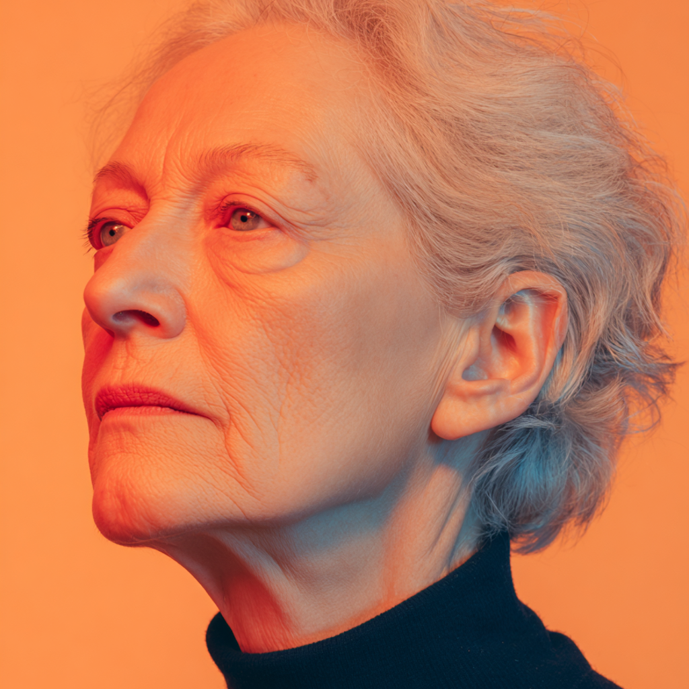
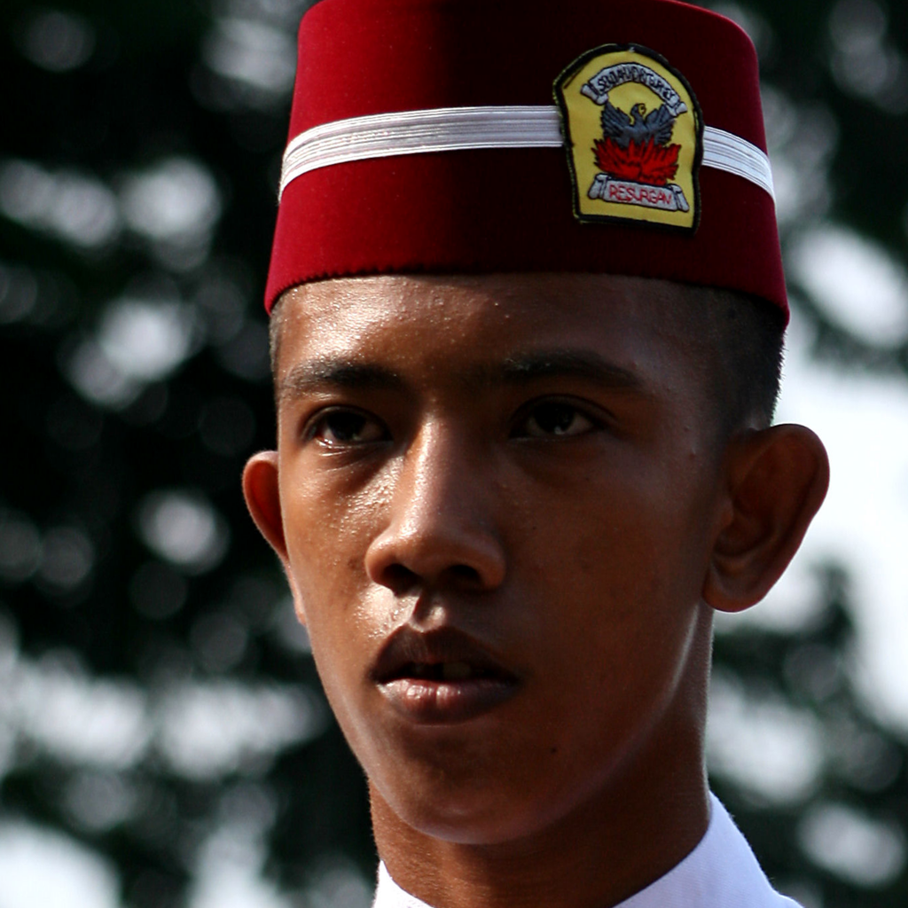
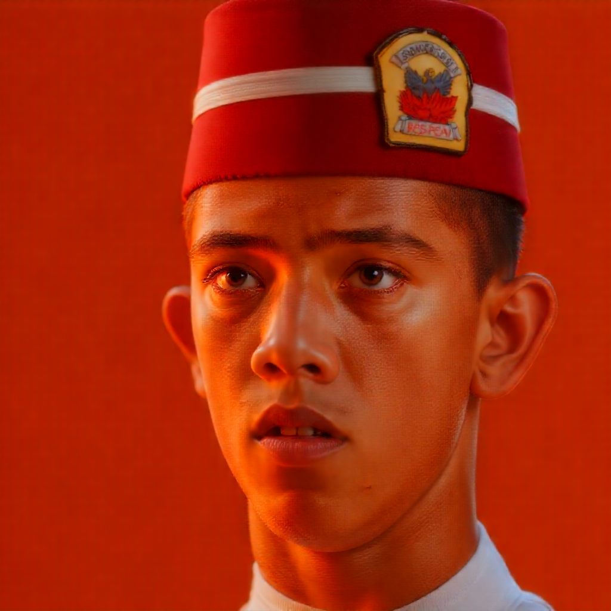
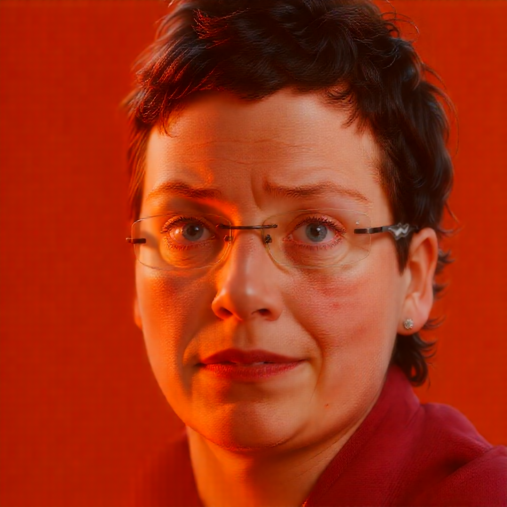
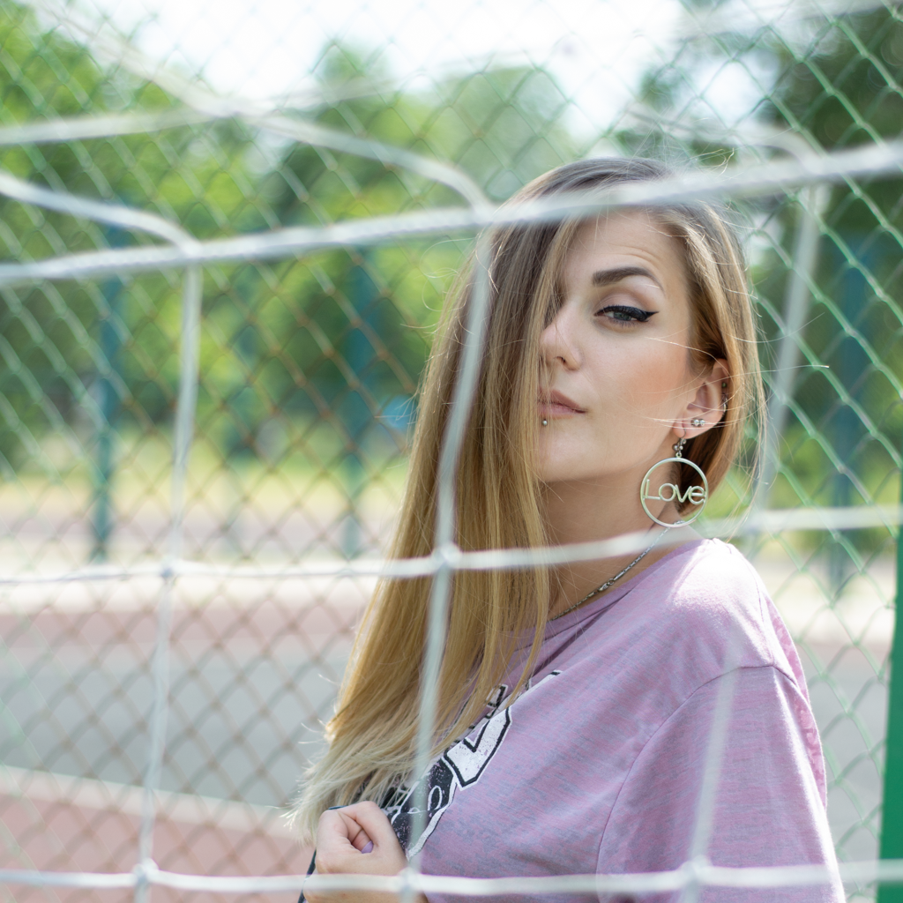
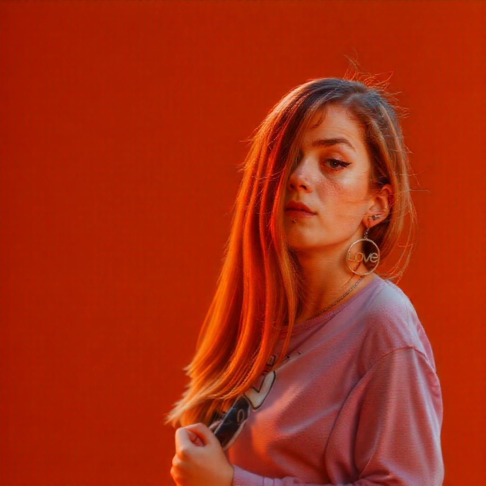
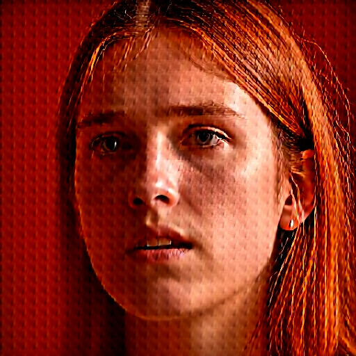

# Promptable Differentiable Rewards

This repository uses vision-language models (VLMs) as differentiable rewards without requiring additional fine-tuning. It was found that InternVL 3 14B is particularly well suited for this task.
The VLM either predicts score tokens to rate a single image or selects the index of the preferred image when ranking multiple inputs. The probabilities of the predicted tokens are used as the loss function, and the gradients of the predicted image are backpropagated through the VLM.
It is possible to perform aesthetic ratings based on the model’s internal aesthetic priors. In this repository, an image-to-image model (Flux Kontext) is fine-tuned, which also requires a loss function measuring the similarity between the input and output images. Since the VLM can be guided by prompts specifying how the rating should be applied, it is possible to separate semantic from stylistic similarity. This approach addresses a core challenge of training image-to-image models in an unpaired manner.
Furthermore, the model can rate the stylistic similarity of two images, enabling training of a new style using only a single reference image.
This repository also includes several loss functions that penalize the typical grid patterns occurring during Flux training. When applied with medium strength, these losses are effective. However, when applied strongly, it is recommended to add an additional loss that penalizes brightness drift.

## Examples

### Style transfer from a single reference

<p align="center">
  
</p>

| Before | After |
|:-----:|:-----:|
|  |  |
|  |  |
|  |  |

Notes:
- The reference is used to reward stylistic similarity (lighting, colors, contrast, overall look) while preserving content.
- Source of first two inputs: ffhq, Source of last input: PPR10K
### Grid pattern artifact

<p align="center">
  
</p>

This grid-like periodic artifact can especially occur when photorealism (AIDE) is over-optimized.

## Features

This repository provides:

- **Multiple Aesthetic Scorers**: InternVL, aesthetic predictors
- **Photorealism Detection**: AIDE-based real/fake classification
- **Anti-Grid Artifacts**: Advanced FFT-based periodic pattern suppression  
- **Similarity Rewards**: LPIPS, face embeddings, InternVL
- **Sharpness & Brightness Controls**: Anchor-based penalties and rewards
- **AlignProp Integration**: Ready-to-use training with FLUX models

## Installation

### Basic Installation

```bash
git clone https://github.com/andjoer/promptable-differentiable-rewards.git
cd promptable-differentiable-rewards
pip install -r requirements.txt
```

### Optional Dependencies

For specific features, install additional packages:

```bash
# Face similarity rewards (you might need to update torch and torchvision afterwards again)
pip install facenet-pytorch

# LPIPS similarity rewards
pip install lpips

# AIDE photorealism detection
git clone https://github.com/shilinyan99/AIDE.git
# Follow AIDE setup instructions
```

## Quick Start

### Example call

```bash
accelerate launch  alignprop_fluxkontext.py \
--data_dir ./train_images \
--mixed_precision bf16 \
--lora_rank 32 \
--log_with wandb \
--log_image_freq 16 \
--save_freq 100 \
--num_epochs 1000000 \
--image_height 512 \
--image_width 512 \
--sample_num_steps 5 \
--image_reward_scale 1.5 \
--sharpness_reward_scale 2 \
--sharpness_backend "internvl" \
--aesthetic_reward_scale 6 \
--similarity_backend "internvl-content" \
--aesthetic_model_type "internvl" \
--train_learning_rate 1e-4 \
--style_reference "$REFERENCE" \
--grid_ratio_weight 1 \
--grid_ratio_period 16 \
--grid_ratio_max_harm 3 \
--grid_ratio_sigma_bins 0.8 \
--grid_eval_resize 512 \
--brightness_target 0.45 \
--brightness_band 0.08 \
--brightness_anchor_weight 10 \
--train_gradient_accumulation_steps 4  
```


### Key Training Arguments

- `--aesthetic_model_type`: Choose from `aesthetic_scorer`, `v2.5`, `qwen`, `internvl`
- `--similarity_backend`: Choose from `lpips`, `face`, `internvl-content`  
- `--photo_backend`: Set to `aide` for photorealism rewards
- `--grid_ratio_weight`: Weight for anti-grid penalties (try 0.05-0.2)
- `--brightness_anchor_weight`: Brightness/contrast anchoring (try 0.1-0.3)

## Individual Tools

### InternVL Scorer

Rate images with various tasks:

```bash
# Single image aesthetic rating
python internvl_scorer.py image1.jpg --task single

# Compare two images  
python internvl_scorer.py img1.jpg img2.jpg --task pair

# Style similarity rating
python internvl_scorer.py ref.jpg test.jpg --task similarity

# Sharpness evaluation
python internvl_scorer.py blurry.jpg --task sharpness
```

### Benchmark Anti-Periodic

Evaluate anti-grid methods on artifact datasets:

```bash
python benchmark_anti_periodic.py \
    --artifacts_dir ./artifacts \
    --clean_dir ./clean_images \
    --out results.csv
```

## Configuration

### Grid Artifact Detection

Configure periodic pattern detection:

```python
grid_config = {
    "weight": 0.1,          # Overall penalty weight
    "period": 16,           # Expected pattern period  
    "max_harm": 3,          # Number of harmonics
    "sigma_bins": 0.8,      # Frequency bandwidth
    "tau": 2e-4,            # Hinge threshold
    "eval_resize": 512,     # Evaluation resolution
}
```

### Brightness Anchoring

Control brightness and contrast:

```python
brightness_config = {
    "target": 0.50,         # Target mean luminance
    "band": 0.06,           # Tolerance band
    "weight": 0.2,          # Brightness penalty weight
    "crisp_weight": 0.2,    # Crispness penalty weight
}
```

## License

This project is licensed under the Apache License 2.0. See LICENSE for details.

## Citation

If you use this code or approach in your research, please cite:

```bibtex
@misc{promptable-differentiable-rewards,
  title={Promptable Differentiable Rewards for Diffusion Model Fine-tuning},
  author={Andreas Jörg},
  year={2025},
  url={https://github.com/youruser/promptable-differentiable-rewards}
}
```

## Acknowledgments

- [Alignprop](https://arxiv.org/abs/2310.03739) for alignprop
- [AIDE](https://github.com/shilinyan99/AIDE) for photorealism detection
- [InternVL](https://github.com/OpenGVLab/InternVL) for vision-language models
- [TRL](https://github.com/huggingface/trl) for AlignProp implementation
- [LPIPS](https://github.com/richzhang/PerceptualSimilarity) for perceptual similarity
- [FFHQ](https://github.com/NVlabs/ffhq-dataset) dataset for faces from flickr
- [PPR10K](https://github.com/csjliang/PPR10K) dataset of portrait photos
  
